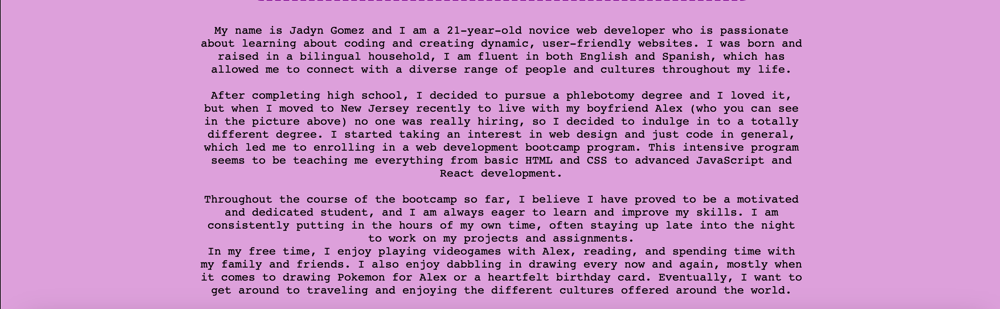

# JGsPortfolioWebpage

## Description
I created a webpage for my own portfolio, which will be used to advocate myself to potential employers. I was tasked with creating the webpage from scratch and making it accessible usig HTML and CSS. Once I made a framework, I started laying out the skeletion of the webpage in HTML and then adding in some styling along the way in a CSS file. This assignment helped me immerse myself into starting a project from screatch and learning how to debug the code when my webpage was having issues.
## Usage

## Link
[Jadyn Gomez's Portfolio](https://jadyngg19.github.io/JGsPortfolioWebpage/)